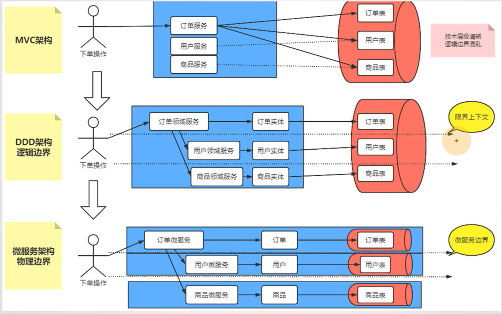
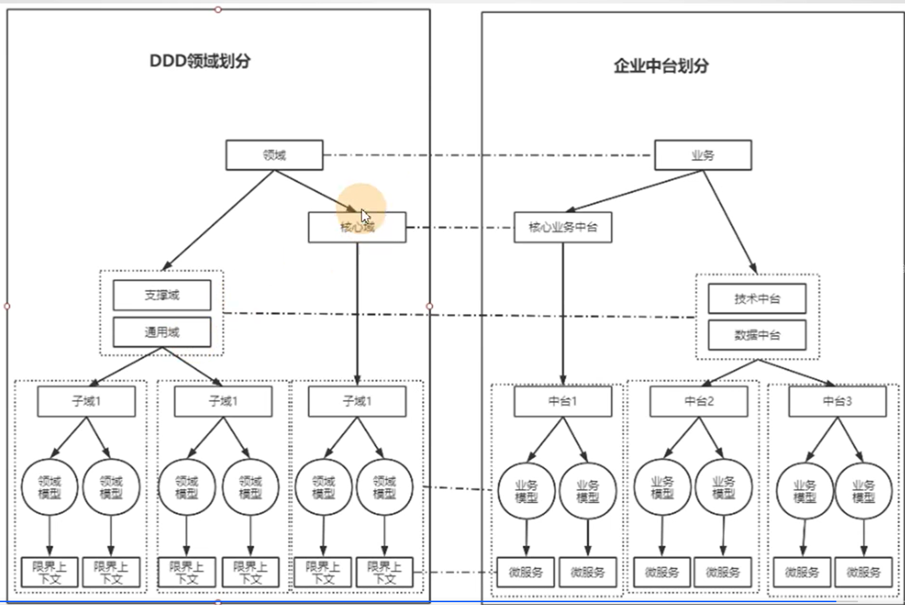
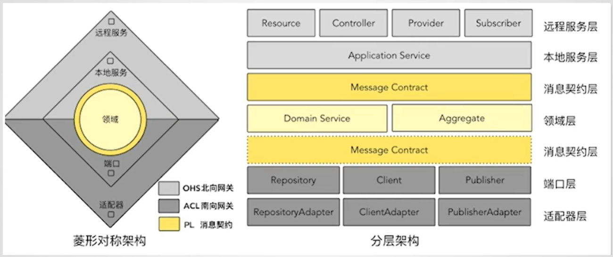
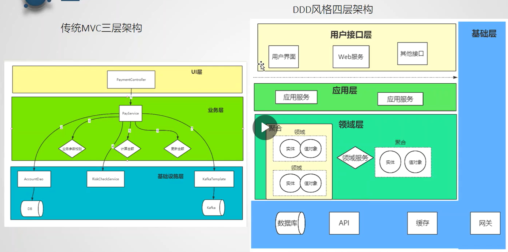

# DDD

在微服务架构流行时期，开始流行。指导微服务架构。

在战略方面，可以指导微服务拆分。
在战术方面，可以指导代码编写。

## 软件复杂性

软件的复杂性体现在“不确定性”，比如设计之初无法预想到一些场景，导致后期需求进入时，很难（成本很大）更改代码或架构，甚至只能推倒重构。

某一项技术的复杂性排在其次。

如果采用具体问题具体设计的方式，你会有无穷无尽的麻烦。但是按照DDD的概念去落地，你会发现，这些变更都自然而然地解决了。

大多数项目来讲，质量最高的是第一个版本。

## 什么是DDD

一种思潮：让技术专家和领域专家一起参与软件建设。

一种架构思想：别再没完没了的重构了，让复杂系统保持年轻。

## 目标

解决大型系统老化问题

## 指导应用架构：战术篇

ddd中的领域服务、实体、值对象、充血模型不是凭空产生的，而是为了应对软件变化，一步步抽取出来的。

充血模型隔离的变化是：业务逻辑分散在 mvc Service 层中。

领域服务隔离的变化是：领域对象互相之间的操作和技术变化。

ddd也不是强制要求软件所有地方都是用充血模型，因为贫血和充血各有各的好处。

贫血模型更像一个简单粗暴的草根，适合团队技术水平参差不齐，软件维护成本较低的团队。

充血模型虽然将数据与行为隔离到了领域对象中，但它更像一个昂贵的贵族，因为缺少强制性约束，更多是需要团队内部从上到下约束，随着软件演进，很容易四不像，需要额外付出成本维护。

因此，实际开发中，在设计方面，可以灵活均衡贫血和充血，一般来讲，可以将核心业务领域使用充血模型维护，其他边缘业务领域使用贫血维护。

最后，通过防腐层保持底层领域模型的稳定，比如 repository 隔离 kafka、数据库变化。

聚合、聚合根隔离的是数据一致性变化。

聚合的关注点是“区域自治”，即在一个具体的业务场景设计中，将一个大的问题拆分成多个相对独立的聚合。

仓库、工厂隔离的是底层存储变化。

## 指导微服务拆分：战略篇

领域

限界上下文

## 指导企业中台建设

异曲同工

## ddd分层方法

强调层与层之间互相依赖，不能跨层依赖。

1. 洋葱架构
2. 六边形架构
3. 清晰架构

三种架构考虑的核心问题都是：前端需求的变 和 领域模型的不变

基于上述三种架构，抽象出通用架构：菱形对称架构

ddd本质是解耦，方法很多，架构思路是一致的。本质的思路是对领域模型进行有效的保护，以减少业务变化对领域模型的影响。

## ddd经典四层架构

1. 用户接口层
2. 应用层
3. 领域层：与外部依赖无关，以面向对象思想（比如实体、值对象、聚合、领域服务）为核心，提供核心业务能力。
4. 基础设施层

