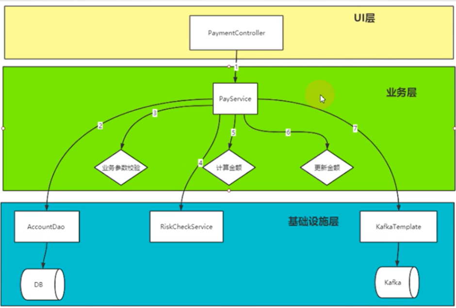
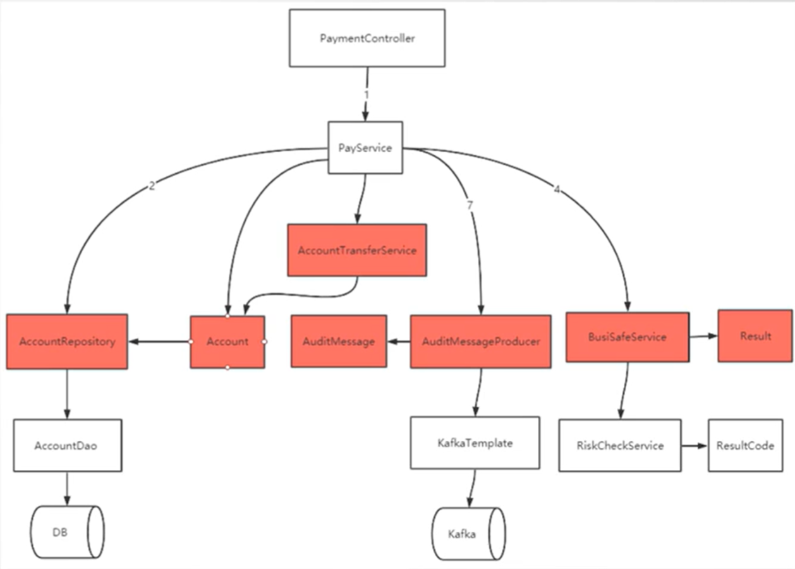
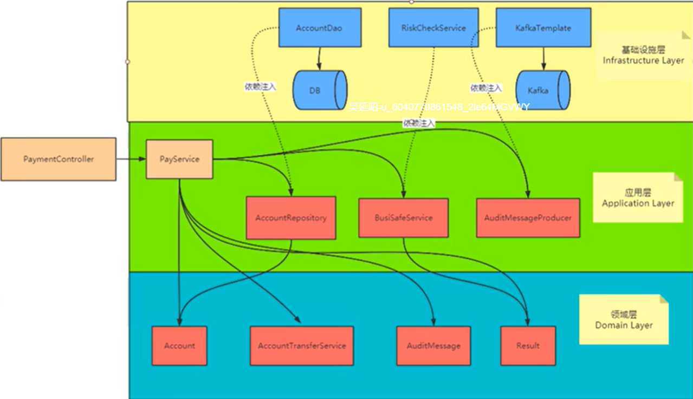
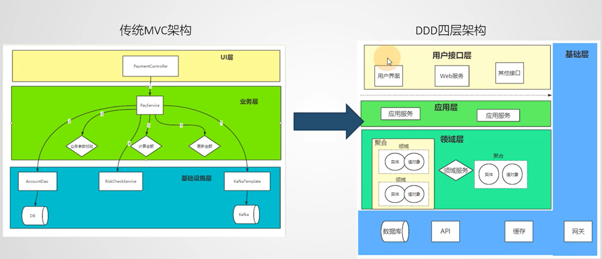

# 示例

改造一个MVC架构的代码到DDD架构。

实际上，这个小Demo并不能完全代表DDD，因为DDD是一种架构设计思想，不像微服务架构，使用上一些技术之后，大体也差不多。

DDD是道，呈现方式各有不同。

但总体来说，他是一种代码演进方法论，用于软件架构、代码设计。

mvc包下面是MVC架构的代码，会有一些问题。

ddd包下面是使用ddd思想重构后的代码，隔离了变化，使得代码更易于维护。

## 方法论
首先，梳理原来的代码层次，分析代码的问题点：

1. PayService 直接依赖了 AccountDao。AccountDao 是直接与具体的数据库交互的，比如 mysql，如果数据库切换，或者 orm 框架发生变化， AccountDao 也需要变化，那么会影响 PayService 代码
2. RiskCheckService 是外部服务，如果发生变化，会影响 PayService。
3. KafkaTemplate 是外部服务，如果发生变化，会影响 PayService。
4. PayService 直接依赖了计算金额的计算方式，如果计算方式发生变化，会影响。
5. 面向过程编程，业务逻辑会随着业务演进越来越复杂，代码越来越难以维护。
6. 单元测试难以实现，QA人员需要消耗更多的时间到回归测试，没有时间保证QA，引起软件质量下降和线上BUG。
7. ...

针对问题点一个个改进，最终形成如下层次：

对应到 DDD 四层架构中：

在四层架构中，每一层关注点不同，演进速度也不同。
比如，用户接口层、基础层会经常变化，因此演进速度很快。
但领域层是问题域层，淘宝要解决的问题域始终是买东西，支付宝要解决的问题域始终是支付，因此变化不会很大、很频繁。